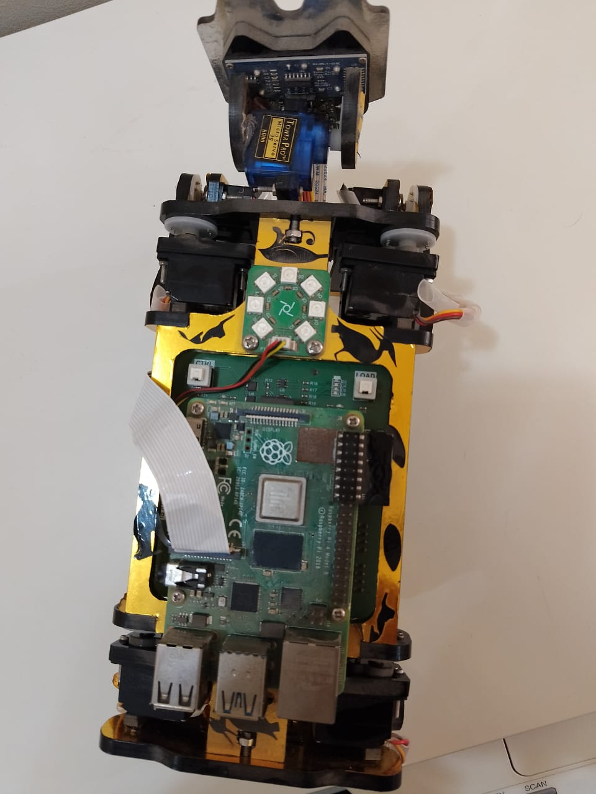
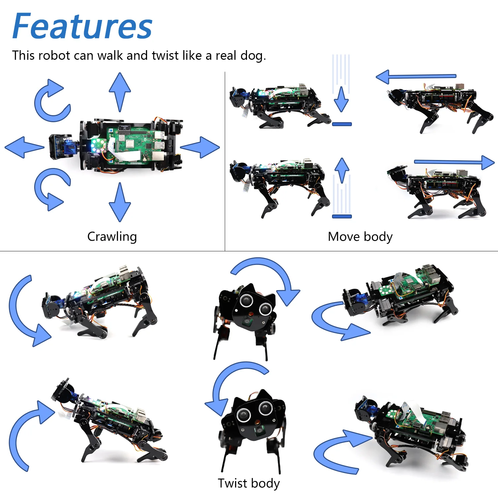
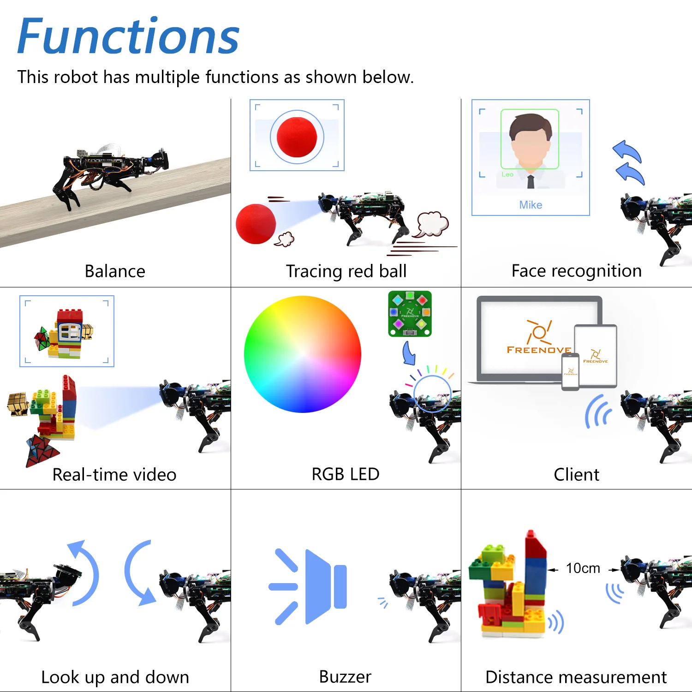
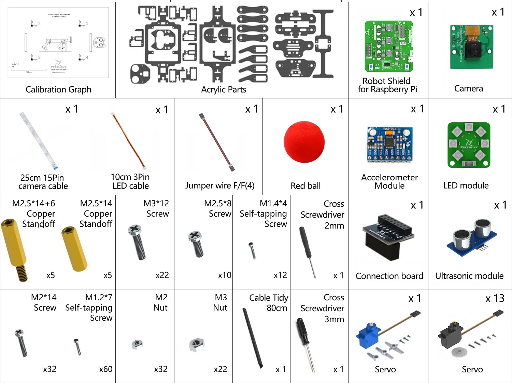

# 🐈‍⬛ PiCat: The Raspberry Pi Robotic Cat



**PiCat** is an advanced, quadruped robotic cat built for a university project. It is based on the Freenove Robot Dog kit architecture but customized into a feline form factor. The project integrates hardware engineering, real-time control via Python, and cross-platform remote operation.

---

## 📥 Quick Download (Ready to Run)
If you want to start controlling **PiCat** immediately without setting up the source code environment, download the pre-compiled applications:

* **📱 Mobile App (Android):** [Download PiCat_Controller](https://play.google.com/store/apps/details?id=com.freenove.suhayl.Freenove)
* **📱 Mobile App (ios):** [Download PiCat_Controller](https://apps.apple.com/us/app/freenove/id1523264732)
---

## 🌟 Features & Functions
PiCat is packed with dynamic movements and smart capabilities powered by the Raspberry Pi and onboard sensors.

### 🦾 Kinematic Features (Movements)
The robot's 13 degrees of freedom allow it to move fluidly like a real animal.



* **Crawling & Walking:** Omni-directional walking capabilities.
* **Posture Adjustment:** Move the body up, down, forward, and backward while the paws stay firmly planted.
* **3D Twisting:** Roll, pitch, and yaw body twists to simulate feline flexibility.

### 🧠 Smart Functions (Sensors & AI)
Beyond basic movements, PiCat can interact with its environment.



* **Self-Balancing:** Uses the MPU6050 Gyroscope/Accelerometer to maintain stability on uneven surfaces.
* **Computer Vision:** Capable of Face Recognition and Object/Color Tracking (e.g., tracing a red ball) using OpenCV.
* **Real-Time Video:** Streams live camera feed directly to the control client.
* **Distance Measurement:** Uses the Ultrasonic sensor to detect obstacles (up to 10cm accuracy).
* **Interactive Feedback:** Features programmable RGB LEDs for status indication and a Buzzer for audio alerts.
* **Head Articulation:** Multi-axis head movements (look up, down, left, right).
* **Cross-Platform Client:** Fully controllable via PC GUI or Mobile App over Wi-Fi.

---

## 🛠️ Hardware Components



* **Controller:** Raspberry Pi (3B+ / 4 Recommended)
* **Shield:** Freenove Robot Shield for Raspberry Pi
* **Actuators:** 13x Servo Motors (Legs and Head movement)
* **Sensors:** Ultrasonic Sensor (Distance), MPU6050 (Balance), Battery Voltage Monitor (ADC)
* **Power:** 2x 18650 Li-ion Batteries

---


## 🚀 Installation & Setup
To run the project from the source code, you need to set up both the Raspberry Pi (Server) and your Windows Computer (Client).

### Part 1: Raspberry Pi Setup (The Server)
**1. Clone the Repo:**
```bash
git clone [https://github.com/YourUsername/PiCat.git](https://github.com/YourUsername/PiCat.git)
cd PiCat/Code/Server

```
* **2.Automated Library Installation:**
The project requires I2C and specific Python libraries. Run the setup script provided:
```bash
sudo python setup.py
```
Reboot your Raspberry Pi after the script finishes.

---

### Part 2: Windows PC Client Setup (Run from Source)
Note: This section is for modifying or running the client interface directly via Python on Windows. Ensure Python 3 is installed on your PC first.
**1. Install Required Libraries:**
Open Command Prompt (cmd) on your Windows PC, navigate to the cloned repository, and run the setup script to install PyQt5, opencv, numpy, and other dependencies:
```bash
cd path\to\PiCat\Code
```
```bash
python setup_windows.py
```
(Wait for the message "All libraries installed successfully". If network errors occur, simply run the command again).

**2. Open the Client Interface:**
Once the libraries are installed, navigate to the Client directory and run the main script:
```bash
cd Client
```
```bash
python Main.py
```

**3. Connect and Calibrate:**

1. Turn on the Raspberry Pi and ensure the server is running.

2. Enter the Raspberry Pi's IP address in the white IP edit box on the Client GUI.

3. Click Connect.

* **Important:** After connecting, navigate to the Calibration section to calibrate the robot dog before attempting any movement.

---

## 🔧 Assembly & Calibration
**CRITICAL**: Before fully assembling the PiCat frame, you must calibrate the servos to avoid mechanical damage.
**1. Connect servos to the Shield.**
**2. Run the calibration command to set all motors to 90 degrees:**
```bash
python Servo.py 90
```
**3. Attach the legs and frame parts once the servos are locked at 90°.**

---

## 🧪 Module Testing
Before running the full system, test each hardware unit individually:

* Test Ultrasonic: ```bash sudo python Ultrasonic.py ```

* Test Servos: ```bash sudo python Servo.py ```

* Test Battery: ```bash sudo python ADS7830.py ```

---

## 🎮 How to Control PiCat
PiCat operates on a Client-Server architecture. You can start the server manually or configure it to run automatically on boot.

### 1. Start the Server (The Cat)
**Method A: Direct Terminal / SSH**
Run the following on your Raspberry Pi:
```bash
cd PiCat/Code/Server
sudo python main.py
```
---
* **Tip:** To run the server without the GUI interface and enable TCP communication (Headless Mode), use:
```bash sudo python main.py -t -n ```

---

**Method B: Remote Desktop via VNC Viewer**
If you prefer a graphical interface to interact with the Raspberry Pi:
1. Download and install VNC Viewer on your PC.
2. Open VNC Viewer -> File -> New Connection.
3. Enter the IP address of your Raspberry Pi and a name (e.g., PiCat).
4. Connect and log in (Default Username: pi, Password: raspberry).
5. Open the terminal and run the commands from Method A.

### 2. Connect the Client (Remote)
* **Via PC:** Open the PC GUI, enter the Pi's IP address, and click Connect.
* **Via Mobile:** Open the PiCat App, enter the IP, and use the on-screen joysticks to move.
---

### 🔄 Advanced: Server Auto-Start (Recommended)
To make PiCat completely standalone, you can configure the Raspberry Pi to start the server automatically as soon as it powers on.
1. Create a startup script:
Open the terminal on your Raspberry Pi and run:
```bash
cd ~
sudo touch start.sh
sudo nano start.sh
```
2. Add the executable code:
   Copy and paste the following into the nano editor:
   ```bash

   #!/bin/sh
   cd "/home/pi/PiCat/Code/Server"
   pwd
   sleep 10
   sudo python main.py -t -n
   ```
   (Press Ctrl+O, Enter to save, then Ctrl+X to exit).

3. Make the script executable:
   ```bash
   sudo chmod 777 start.sh
   ```
4. Set up Desktop Autostart:
   Create the autostart directory and file:
   ```bash
   mkdir -p ~/.config/autostart/
   sudo nano ~/.config/autostart/start.desktop
   ```

5. Add the desktop entry configuration:
   ```bash
   [Desktop Entry]
   Type=Application
   Name=PiCat_Server
   NoDisplay=true
   Exec=/home/pi/start.sh
   ```

   (Press Ctrl+O, Enter to save, then Ctrl+X to exit).

6. Apply permissions and Reboot:
   ```bash
   sudo chmod +x ~/.config/autostart/start.desktop
   sudo reboot
   ```
Once the Raspberry Pi restarts, PiCat will automatically wake up and wait for client connection!

---

## 🤝 Acknowledgments
* Inspired by the Freenove Robot Dog Kit.
* Developed as a University Project for sustainable robotics exploration.
